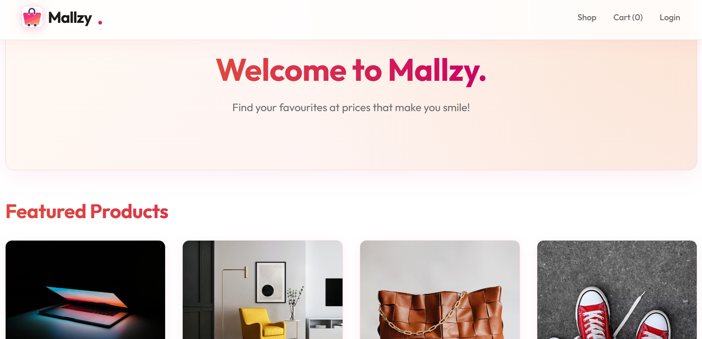

# Mallzy 🛍️

A full-stack MERN e-commerce platform with product listings, cart, checkout, order history, and an admin dashboard for managing the store, with Razorpay payment integration (sandbox mode).

## 🔗 Live Demo

[https://ecommerce-mallzy.onrender.com](https://ecommerce-mallzy.onrender.com)

## 🛠️ Tech Stack

- MongoDB
- Express.js
- React
- Node.js
- Razorpay API
- Cloudinary
- JWT Authentication

## ✨ Features

- Product catalog with browsing and search
- Shopping cart and checkout flow
- Order history for customers
- Payment-gateway integration via Razorpay (sandbox mode)
- Admin dashboard for managing products, orders, and users
- Image uploads via Cloudinary
- JWT-based user authentication and authorization
- Email notifications via Nodemailer

## 📸 Screenshots



## 🚀 Running Locally

```bash
git clone https://github.com/soumyadeep-b/ecommerce-mallzy.git
cd ecommerce-mallzy
```

Install all dependencies (root, backend, and frontend) in one go:

```bash
npm run install-all
```

Create a `.env` file inside the `backend` folder:

PORT=5000
MONGO_URI=your_mongodb_connection_string
JWT_SECRET=your_jwt_secret_key
CLOUDINARY_CLOUD_NAME=your_cloudinary_cloud_name
CLOUDINARY_API_KEY=your_cloudinary_api_key
CLOUDINARY_API_SECRET=your_cloudinary_api_secret
RAZORPAY_KEY_ID=your_razorpay_key_id
RAZORPAY_KEY_SECRET=your_razorpay_key_secret
GMAIL_USER=your_gmail_address
GMAIL_PASS=your_gmail_app_password
FRONTEND_URL=http://localhost:3000
NODE_ENV=development

Run both backend and frontend together:

```bash
npm run dev
```

This starts the backend (with nodemon) on `http://localhost:5000` and the frontend (React) on `http://localhost:3000`.

## 👤 Author

Soumyadeep Biswas
[LinkedIn](https://linkedin.com/in/soumyadeep-biswas-264066418) • [GitHub](https://github.com/soumyadeep-b)
